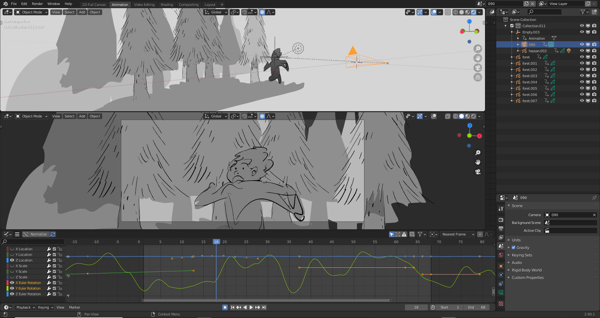
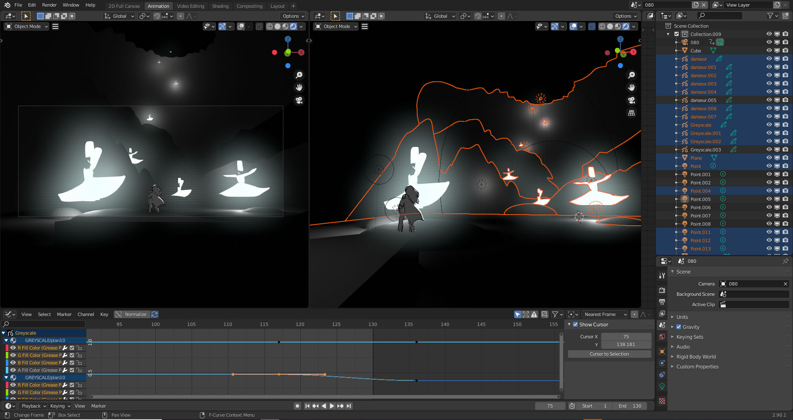

# Concept Art - Storyboard 2D

- Concept Art
    - Simples, mas funcional, para transmitir a ideia do projeto.
- Ideação (formule a ideia do projeto, refletindo sobre ele...)
    - Quando? `No começo da noite...`
    - Onde? `Na calçada da Avenida C, Quadra 40, Lote 8-D, do Parque da Colina II, da cidade de Formosa-GO. Em meu lote comercial...`
    - Quem? `Uma mulher de 40 anos aproximadamente, andando sozinha na calçada...`
    - Qual a história? `Mulher anda na calçada comercial, interagindo com o ambiente de iluminação...`
- Sinopse
> Mulher fica parada antes de entrar na calçada.  
> A mulher se mostra pensativa.  
> Mulher entra na calçada.   
> Durante a caminhada, toda a área ao seu redor fica iluminada.  
> Mulher anda por toda a calçada.  
- Argumento (sem se preocupar com o uso das técnicas da animação e de filmagem)
> Às 19:00, quando já não havia iluminação natural na rua, mulher se aproxima de calçada comercial que deveria ser atravessada por ela, antes de chegar em sua casa.  
> Mulher fica parada antes de entrar na calçada e olha para o ambiente da calçada.  
> A iluminação da calçada é indireta mas se pode perceber que não há outra pessoa na calçada.  
> A mulher pensa um pouco sobre o risco de andar na calçada.  
> Ela olha a iluminação indireta e percebe que não há risco relevante neste espaço, mas tem um pouco de medo do ambiente de iluminação indireta.  
> Ela arrista entrando na calçada.  
> Durante a caminhada, toda a área ao seu redor fica iluminada, a uma distância de 4 metros ao seu redor.  
> A iluminação segue a caminhada da mulher, com ilumição de mais lumens, ao redor da mulher.  
> Ela se sente segura e continua o passeio, mesmo durante a noite.  
> Mulher termina o percurso da caminhada feita na calçada comercial.  
- Roteiro Textual  (tendo preocupação com o uso das técnicas da animação e de filmagem)
    - CENA 1
    > EXT. RUA - 19:00  
    > Mullher anda na rua e alcança começo da calçada comercial. Ela olha para ambiente da calçada comercial e consegue ver todo o espaço que tem iluminação fraca e indireta. Mulher avalia risco de entrar na calçada comercial. Depois de alguns segundos, entra na calçada mais externa e depois na calçada comercial. Ela percebe que há a iluminação do local é dinâmica e automatizada, acompanhando-a na caminhada. A iluminação ocorre em todos os elementos do ambiente em um raio de 4 metros tendo como centro a posição da mulher. O ambiente se torna facilmente visível, tanto o piso da calçada, quanto arvores murta de cheiro que se encontram no limite da loja comercial, quanto na grama do estacionalmento público comercial, quanto nas árvores do tipo Ipê que estão plantadas na calçada. Mulher passa a não ver qualquer risco na caminhada e chega até o final da calçada, terminando esta etapa de sua caminhada.  
- Design Gráfico em Quadros
    - Função única de se testar a utilização de personagens e de cenários
    - Esboço à mão (lápis ou desenho 2D digital)
    - Teste de posições
    

 1.4 Conceito do Projeto
A iluminação noturna, vista à distância, não deve atrair a atenção de transeuntes e não deve ofuscar a visão dos mesmos. A iluminação à distância será de baixa visibilidade, mas suficiente para que o usuário saiba que o ambiente está iluminado. Ou seja, não aumentará a atenção do usuário ao mesmo tempo que gerará segurança ao mesmo, para adentrar no espaço da calçada. Assim, á distância, o foco do design da iluminação encontra-se na tranquilidade e no sentimento de ambiente seguro.
No que se refere ao ambiente próximo do usuário, dentro de um alcance de 4 metros, o objetivo da iluminação é gerar iluminação para todos os elementos do ambiente, com clareza suficiente, mas com temperatura de cor alta, no sentido de não atrapalhar o ciclo cicardiano do usuário. O usuário não deve perder nada, no ambiente escuro da noite. Quanto mais próximo de uma elemento do, mais este elemento deve ficar iluminado. Mas sem se gerar ofuscamento na visualização dos elementos.
A Iluminação deve ser alterada devido a interação do usuário, mediante movimento de andar do usuário, a iluminação deve se locomover junto com o usuário.

- Source: https://www.blender.org/user-stories/the-future-of-storyboarding-blender-for-pre-production/
    - Modern storyboard artist choices:
        - The basis for the whole production
        - Grease Pencil with low poly assets
        - 2D animation against a 3D environment
        - An accurate representation of a 3D world
        - “I’m pushing a way of working where we do a first pass in Blender, using only low-poly characters and environments. Plus some basic rendering in EEVEE, and a bit of rigging. Basically, staging each scene in Blender to get a feel for it. Then capturing stills of these 3D images and using them as the basis for more refined 2D art. Which in turn fuels the more traditional 3D part of the production.”
        - An advanced form of pre-visualization
        - This technique delivers the most value in action sequences, where space and camera movement are paramount.
    - Example of hybrid 2D/3D storyboarding
        - https://vimeo.com/478816885
        - Images source: https://www.blender.org/user-stories/the-future-of-storyboarding-blender-for-pre-production/
        - 
        - 
        - 
        - 
        - 
        
    - Tips:
        - For lines in Grease Pencil, Alex keeps it simple. “A storyboarder’s work will always be replaced with a 3D image, so I stick to basics. The pencil tool is more than enough for what I need.” In fact, Alex considers the pencil tool so good, he’ll be using it in the final version of Maryam & Varto. Alex: “Those Grease Pencil lines will be on screen. The line and the render will all be Grease Pencil.” 
        - Alex likes the shadow effects created by Grease Pencil materials. “When you bring a light into the face of a character, you get this nice soft shadow. It looks amazing. It’s not flat anymore.”
        - He’s a big fan of the sculpting brush, and not just for refining lines. “I’m using this constantly. You can use it to create squash and stretch. In fact, you can pretty much re-pose a character this way.”
        - Because storyboarding relies on speed, Alex animates Grease Pencil objects in minimal ways. “For instance, if I’m animating a character walking, I’ll animate the Grease Pencil object along its axis, with ups and downs, as the basis for the walk cycle. Which means I have to draw less. You can get a lot of expressivity out of just animating this one drawing.” 
    - Tutorials:
        - https://www.youtube.com/@SpitfireStoryboards
        - https://vimeo.com/user2104760

    1.  Esboço de projeto e processo de iluminação que serão apresentados em artigo de TCC IPOG.

1.1 Projeto: Iluminação automatizada, de espaço de caminhada, em calçada de concreto, em ambiente arborizado, no período noturno.
 
1.2 Espaço da Implantação do Projeto:
Calçada comercial mais interna (1,2 metros de largura e comprimento por toda uma quadra comercial)
Calçada com piso de concreto, com baixa declividade, ambiente propício para andar, mas possivelmente com velocidade rápida.
No lado do comércio há plantio linear de árvores do tipo Murtas de Cheiro, com distância aproximada de 30 centímetros entre elas. Árvores com altura média de 1,8 metros.
Não lado da avenida, há estacionamento gramado e com árvores isoladas do tipo Ipê, sendo que se alterna entre Ipê amarelo, rosa, roxo e branco.
A iluminação automatizada deve ser usada apenas desde o final da tarde, quando a iluminação natural torna-se menor até o período da manhã quando houver iluminação suficiente.
A iluminação deve atender uma visualização ###  a uma distância de 50 metros, aproximadamente, e deve fornecer iluminação suficiente quando o usuário estiver a uma distância de 4 metros do ponto de visualização na calçada.
Deve ocorrer a iluminação do piso, das árvores murta de cheiro, da grama e das árvores Ipê, quando estes elementos do espaço se encontrarem  dentro da distância de 4 metros em relação ao usuário da calçada.
Quando o usuário estiver a uma distância maior, a iluminação será apenas indireta e apenas será suficiente para que se saiba que o ambiente é iluminado.

 
# Na Porteira
> Como parte da renovação do urbanismo de Formosa-GO, o administrador do "Clube de Eventos: Na Porteira", deseja prover um local de harmonia, felicidade e satisfação para os moradores da cidade. Este ambiente remete às origens campestres da cidade. Buscamos prover espaço para eventos sociais valorizando o cuidado com o meio ambiente e valorizando a vida das pessoas.
  
> "Na Porteira" é a entrada para o ambiente campestre.  
> Espaço para valorizar e cuidar da natureza.  
> Espaço para valorizar e cuidar das pessoas.  

Francês
Inglês
Português
Espanhol
Italiano

# INKSCAPE
- Software de desenho vetorial

## Referências:
- https://www.behance.net/
- https://unsplash.com/pt-br
- https://pixabay.com/
- https://www.pexels.com/pt-br/
- https://www.freepik.com/
- https://thenounproject.com/
- https://www.flaticon.com/br/
- https://br.pinterest.com/#search
- https://color.adobe.com/
- https://colorshark.io/

##  Ferramentas (com painel de propriedades específico):
- Seletor `s` `selector`
    - Selecionar e transformar objetos
    - `shift click` selecionar vários objetos
    - `ctrl scaleSentido` scalar como um todo, na direção solicitada.
    - `ctrl rotateSentido` Rotacionar de 15 em 15 graus
- Editor de Nós `n`
    - Editar caminhos de Nós
- Retângulo `r` `rectangle`
    - Criar ou editar retângulos ou quadrados a partir da borda clicada.
    - `shift click` Criar retângulo a partir do centro clicado.
- Círculo/Arco/Elipse `e` `ellipse`
    - Criar ou editar círculos, elilpses ou arcos a partir da borda clicada.
    - `shift click` Criar elipse a partir do centro clicado.
- Polígonos `*` `polygon`
    - Criar ou editar polígonos e estrelas
    - `shift click` Criar estrela a partir do centro clicado.
- Caixa 3D `x` `3D box`
    - Criar ou editar Caixas 3D
- Espiral `i` `spiral`
    - Criar ou editar espirais
- Caneta Bézier `b`
    - Desenhar curvas e linhas bézier
- Lápis (pencil) `p` `pencil`
    - Desenhar linhas livremente
- Caneta Caligráfica `c` `calligraphic pen`
    - Desenhar curvas caligráficas ou traços de pincel
- Texto `t` `text`
    - Criar ou editar textos de parágrafos e comuns
- Gradiente `g` `gradient`
    - Criar ou editar definições de gradiente
- Malha `mesh`
    - Criar ou editar malhas de gradiente
- Conta gotas `d` `dropper`
    - Capturar cores dos objetos
- Balde de tinta `u` `paint bucket`
    - Preencher áreas fechadas 
- Ajustador `w` `adjuster`
    - Ajustar objetos deformando, esculpindo ou pintando 
- Pulverizador `a` `spray`
    - Pulverizar cópias ou clones de objetos
- Borracha `up e` `eraser`
    - Apagar objetos ou caminhos 
- Conector `o` `connector`
    - Criar conectores de diagrama 
- Medidor `m` `meter`
    - Medir objetos 
- Zoom `z`
    - Ampliar ou reduzir zoom
- Páginas
    - Criar ou editar páginas do documento